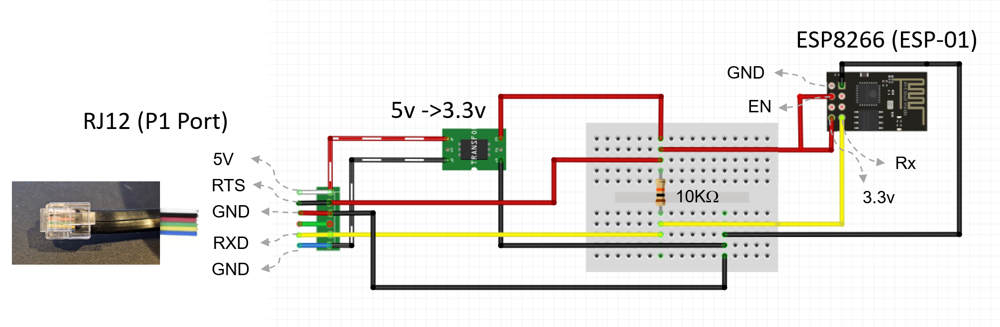

# P1 Port Smartmeter Data Uploader to Google Sheets

## Project Overview
This project provides a solution for uploading data from a Smartmeter's P1 port directly to a Google Sheet. It's designed to work with the ESP8266 microcontroller powered from the P1 port itself; specifically, the ESP-01 module has been used, but the setup can be easily adapted for a Wemos D1 without the need for a voltage divider.

## Schemas
Included in this repository are two schemas for connecting the P1 port to the ESP8266:

- `Schema-ESP-01.png`: For setting up with ESP-01.
- `Schema-Wemos-D1.png`: For setting up with Wemos D1.




## Hardware Setup

1. Connect the Smartmeter's P1 port to the ESP-01 according to the `Schema-ESP-01.png`.
2. Ensure that the voltage levels are compatible (5V to 3.3V).
3. Use the provided Arduino sketch (`p1smartmeter2googlesheet.ino`) and Http library (`lib/HTTPSRedirect-main.zip`) to program the ESP8266.
4. Select the correct board and port in the Arduino IDE.
5. Upload the `.ino` sketch to the ESP8266.

## Software Setup

### Google Apps Script Deployment
To connect the ESP8266 to your Google Sheet, you'll need to deploy a Google Apps Script as a web app and retrieve the deployment ID.

1. Open Google Drive and create a new Google Sheet.
2. In the Google Sheet, navigate to `Extensions > Apps Script`.
3. Delete any code in the script editor and replace it with the content of `p1smartmeter2googlesheet.gs`.
4. Save the script with a meaningful name.
5. Click on `Deploy` > `New deployment`.
6. Select `Web app` under `Select type`.
7. Fill in the details for the deployment and ensure that `Who has access` is set to `Anyone`.
8. Click `Deploy` and copy the `Deployment ID` that is provided.

### Configuring the Arduino Sketch
Once you have your deployment ID, you need to configure the `.ino` file to include this ID and your Wi-Fi credentials.

1. Open the `p1smartmeter2googlesheet.ino` file in your Arduino IDE.
2. Look for the following lines of code:

```
const char* ssid = "YOUR_WIFI_SSID";
const char* password = "YOUR_WIFI_PASSWORD";
const char* google_script_id = "YOUR_GOOGLE_SCRIPT_DEPLOYMENT_ID";
```

3. Replace `YOUR_WIFI_SSID` with the SSID (name) of your Wi-Fi network.
4. Replace `YOUR_WIFI_PASSWORD` with the password of your Wi-Fi network.
5. Replace `YOUR_GOOGLE_SCRIPT_DEPLOYMENT_ID` with the deployment ID you copied from the Google Apps Script web app deployment.

Make sure that you do not share your Wi-Fi credentials or Google Script Deployment ID publicly when sharing your code.


## Usage
With the hardware set up, the Arduino sketch uploaded, and the Google Apps Script deployed, your ESP8266 will start sending data from the Smartmeter to the linked Google Sheet. The data transfer will occur automatically based on the code's logic in the `.ino` file.  You can change the data log frequency in the .ino file (`const int UPDATE_INTERVAL = 60000;  // in milliseconds`)

Here is a screenshot of the expected result :


Feel free to add some charts and data analysis in other Sheets.  First Sheet must be reserved for data recording. 

## Troubleshooting
If you encounter any issues with data not appearing in your Google Sheet, verify the following:
- The ESP8266 is correctly connected to the Smartmeter.
- The Wi-Fi credentials in the `.ino` file are correct and the ESP8266 is connected to the internet.
- The Google Script is correctly deployed, its Deployment ID is correctly entered in the `.ino` file.  
- The Google Apps Script is deployed correctly as a web app and has the correct permissions.

For further issues or contributions, please refer to the contributing section of this document.

## Contributing
Feel free to fork this project, submit pull requests, or report issues to enhance the functionality and reliability of the data upload process.

## License
This project is licensed under the [LICENSE](LICENSE.md) file in this repository.

## Credits
This project is based on the following :
- https://github.com/daniel-jong/esp8266_p1meter
- https://github.com/StorageB/Google-Sheets-Logging
- https://github.com/electronicsguy/HTTPSRedirect

Thanks to the authors.